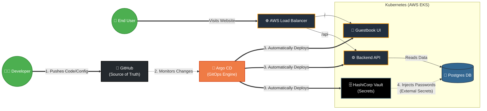
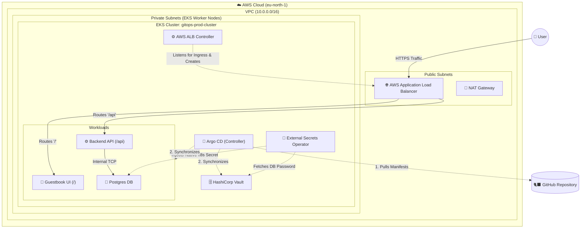

# GitOps EKS Production Architecture

Welcome to the production GitOps repository! This repository contains both the Infrastructure as Code (Terraform) to build a secure AWS EKS cluster, and the GitOps manifests (Helm/Argo CD) to deploy the microservices.

## 🌟 High-Level Architecture (Demo View)
This diagram illustrates the high-level GitOps workflow and traffic routing, perfect for understanding the value of the platform.



## 🛠️ Network Architecture (Engineering View)
This diagram illustrates the deep-dive AWS network topology, VPC boundaries, and exact component placement.



---

## 1. AWS Authentication
Before running any Terraform, you must authenticate your terminal with AWS.
```bash
# If using AWS IAM Identity Center (SSO):
aws sso login

# Or verify existing credentials:
aws sts get-caller-identity
```

## 2. Infrastructure as Code (Terraform)
This repository uses Terraform to provision the AWS VPC and a fully private EKS cluster. The state is securely stored in an AWS S3 backend (`acme-corp-terraform-state-e31e6482`).

```bash
cd terraform/
terraform init
terraform plan
terraform apply
```
*Note: Provisioning the EKS cluster and Node Groups takes approximately 15-20 minutes.*

## 3. Connect to the Cluster
Once Terraform completes, update your local `kubeconfig` to talk to the new cluster:
```bash
aws eks update-kubeconfig --region us-east-1 --name gitops-prod-cluster
```

## 4. Install Argo CD (The GitOps Engine)
Argo CD is the only tool we install manually. Once installed, it takes over and deploys everything else in this repository automatically.
```bash
kubectl create namespace argocd
kubectl apply -n argocd -f https://raw.githubusercontent.com/argoproj/argo-cd/stable/manifests/install.yaml
```

## 5. Deploy Workloads
Apply the root ApplicationSet. Argo CD will instantly read the `infrastructure/` and `workloads/` directories in this repo and spin up all microservices, Vault, and the External Secrets Operator.
```bash
kubectl apply -f infrastructure/argocd/workloads-appset.yaml
```

## 6. Secrets Management
We follow the strict GitOps rule: **Never commit passwords to Git.**
- **HashiCorp Vault** is deployed automatically by Argo CD.
- **External Secrets Operator (ESO)** is deployed to read from Vault.
- The `postgres` and `backend-api` Helm charts contain `ExternalSecret` templates that instruct ESO to fetch the `db-password` from Vault at runtime and inject it into the pods.
